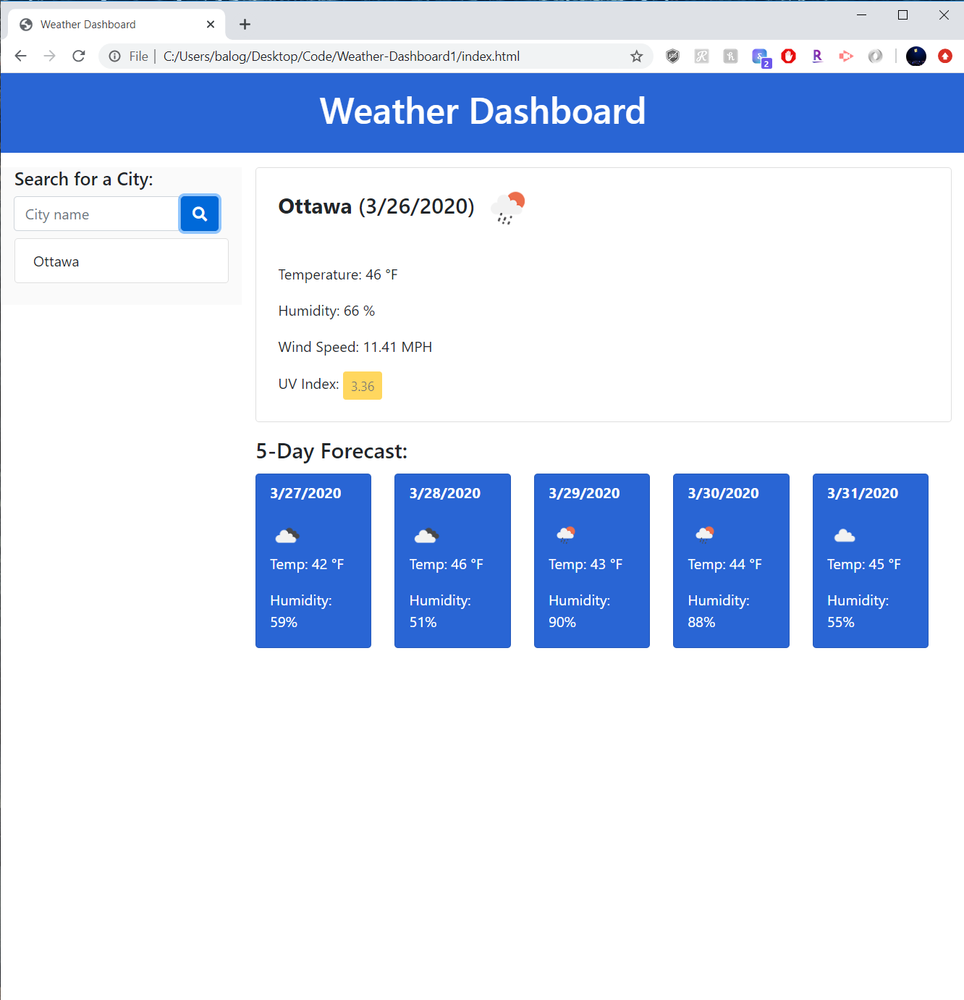

# Weather-Dashboard

# DayEventPlanner

Building a weather dashboard that will run in the browser and feature dynamically updated HTML and CSS.
Use the OpenWeather API to retrieve weather data for cities. Using localStorage to store any persistent data.

# Link to Webpage

# Demo Screenshot
# Start Page

# City search and Result Page

